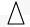
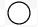
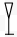

# Discard

# Table of Contents
1. [Introduction](#introduction)
2. [Configuration parameters](#config-parameters)
    * [Number of players](#no-of-players)
    * [Number of cards](#no-of-cards)
    * [Cards per player](#cards-per-player)
3. [Fixed Parameters](#fixed-parameters)
    * [Colours](#colours)
    * [Shapes](#shapes)
4. [Rules](#rules)
    * [General Rules](#general-rules)
    * [Punishments](#punishments) 
    * [Normal Cards](#normal-cards)
    * [Special Cards](#special-cards)
        + [Rules](#rules)
        + [Combination Rules](#combination-rules)

<!-- toc -->

## Introduction

Welcome to `Discard`!!!. This game is a derivative of [Uno](https://en.wikipedia.org/wiki/Uno_(card_game)). The goal of `Discard` is to be the first to discard your all cards, while stopping the other players from doing so.  

The game starts with two decks(a playing pile and a market pile) and some amount of [players](#no-of-players) and assigns a set [number](#cards-per-player) of cards to each player. The game is turn-based. Each player exhausts his turn by choosing a card(s) from their cards , [matching](#general-rules) that card(s) with the card on the top of the playing pile and then playing the card(s). The game end when a player has discarded all their cards.  

## Config-parameters

### No-of-players
2 - 8

### No-of-cards
110+

### Cards-per-player

| Number of players | Number of cards    
| ----------------: | --------------:  
| 2 | 8
| 3 | 6
| 4 | 5
| 5 | 5
| 6 | 5
| 7 | 5
| 8 | 4

## Fixed-parameters

### Colours

Red, Blue, Green, Yellow

### Shapes

| Shape | Image 
| ----- | ----- 
| Cross |              
| Square | 
| Triangle | 
| Circle | 
| Cup |         

## Rules

### General-rules

Cards are matched if:

- A Normal Card on the shape on the card and/or the colour of that shape
- A Special Card on character on the card and/or the colour of that character

### Punishments

- If a player plays a card that does not match, the player may be punished by making that player pick two cards.
- If a player does not indicate that they have one card remaining, then they are made to pick a card. 

### Normal-cards

No rules

### Special-cards

The characters in `''` are characters on the card faces. The rules are as below:

#### Rules

| Card | Action | Combinable | Stackable | Cards | Order |  
| :---- | :------ | :----------: | :----: | :----: | :----: | 
| `'1'`  | Pick one card | Yes | Yes | `'?'`, `'-'` | `['?', '1']`, `['-', '1']`
| `'2'`  | Pick two cards | Yes | Yes | `'?'`, `'-'` | `['?', '2']`, `['-', '2']`
| `'-> '` | Skip the next player | Yes | No | `'?'`, `'-'` | `['?', '->']`, `['->', '?']`, `['->', '-']`, `['-', '->']` 
| `'?'` | Ask for any card | Yes | No | `'-'`, `'->'`, `'1'`, `'2'` | `['?', '->']`, `['->', '?']`, `['?', '1']`, `['?', '2']`, `['-','?']`, `['?','-']`
| `'-'` | Drop a card | Yes | No | `'-'`, `'->'`, `'1'`, `'2'`, `'?'` | `['-', '-']`, `['-', '?']`, `['?', '-']`, `['-', '->']`, `['->','-']`, `['-','1']`, `['-','2']`

'__Combinable__' means that the player can play this card with atmost one other card. 

'__Stackable__' means that if the player plays this card, subsequent players in turn can play the same type of card according to the [rules](#general-rules), and avoid the penalties associated with that type of card. The player that cannot play that type of card pick the __sum total__ of the same type of that card already played.

#### Combination-rules

The order in `[]` is read from _left to right_, that is the first `''` is the card that is played _first_ and the second `''` is the card that is played _next_.

| Cards | Action |
| :---- | :----- |
| `['?', '1']` | Everybody picks a card and you play again
| `['?', '2']` | Everybody picks two cards and you play again
| `['-', '1']` | Discard a card
| `['-', '2']` | Discard two cards 
| `['?', '->']`, `['->', '?']` | Skip everybody and play again
| `['-', '?']`, `['?', '-']` | Remove a SpecialCard from the first player that has a Special Card.If there are no special cards, the player can discard one extra card.
| `['-', '->']`, `['->', '-']` | Remove a SpecialCard from the next player in turn. If 	the player does not have a SpecialCard, the player can discard one extra card.
